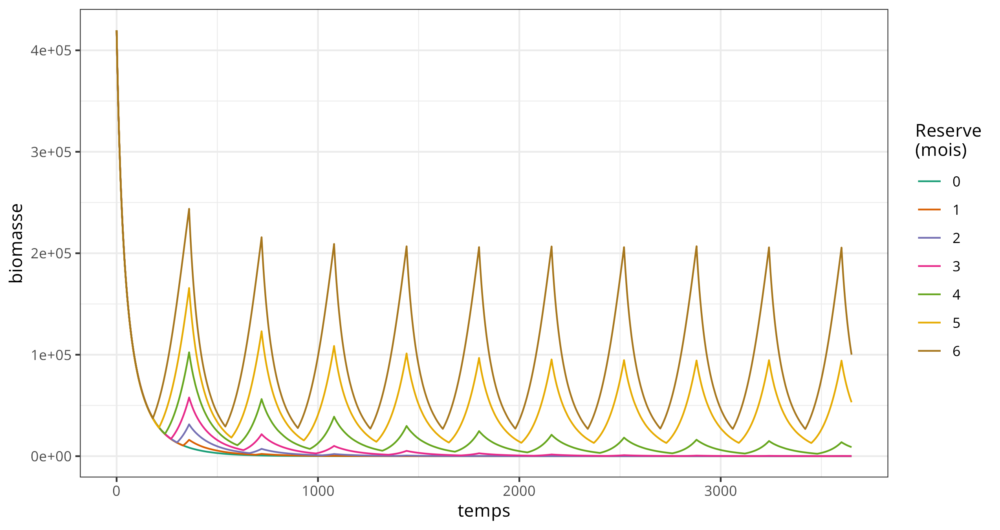
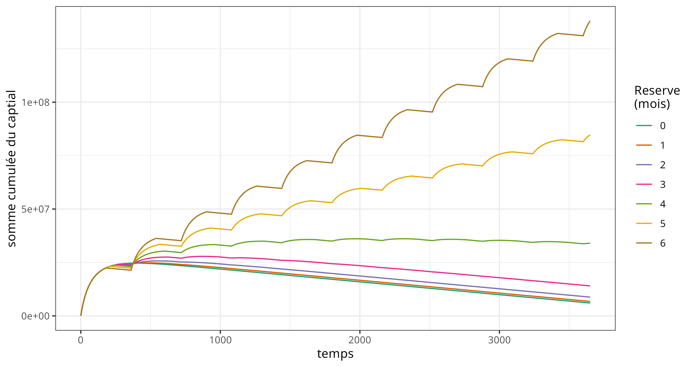
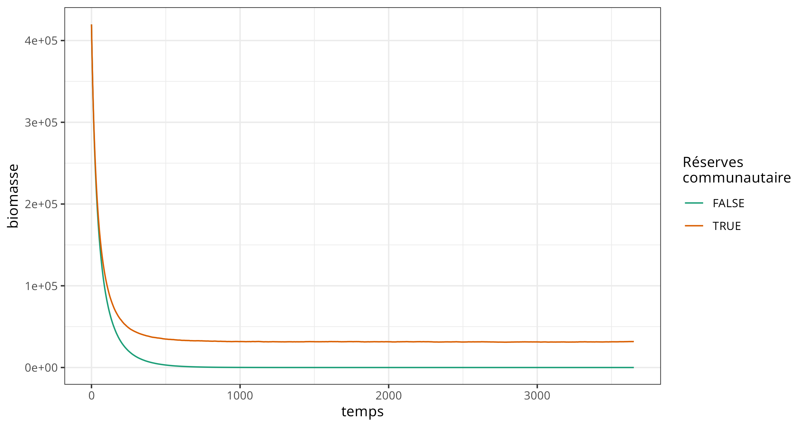
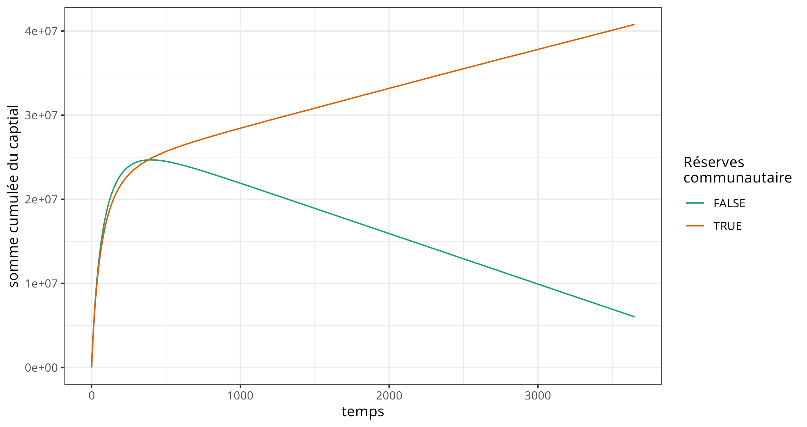
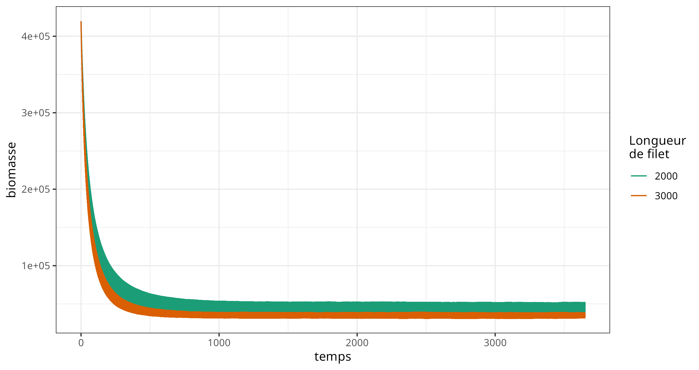
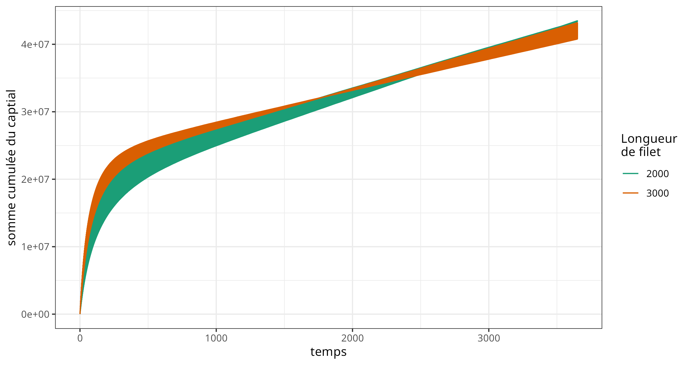
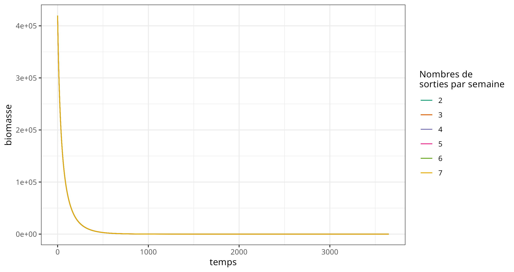
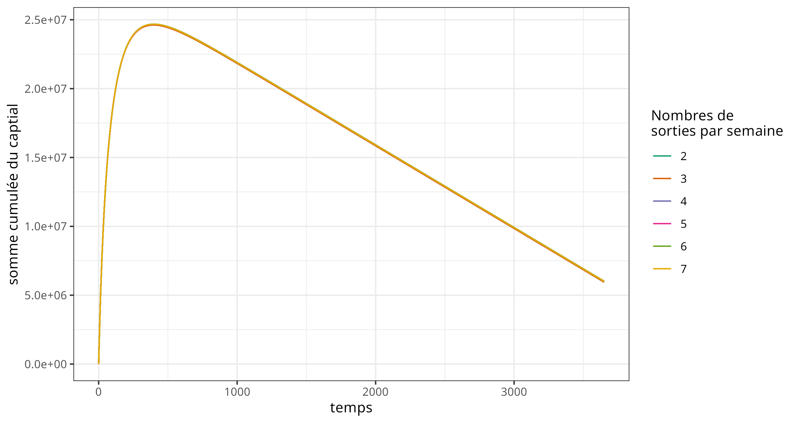
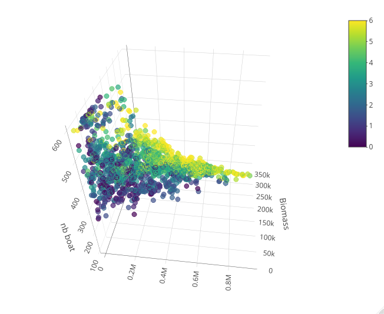

# viabFishSng
Le travail sur se modèle se fait dans le cadre du [projet Santés et Territoires](https://www.santes-territoires.org/). 

- test stratégie de pêches
	- nombre de sorties :white_check_mark:(M0)
	- zone d'exclusion de pêche (temporaire ou intégrale) :white_check_mark:(M0)
	- longueur des filets :white_check_mark:(M0)
    - choix des zones de pêches 
	- communication pour les zones de pêches
	- expliciter le lien entre la distance de sortie et le cout de la sortie (entretien des pirogues)
	- travailler sur les stratégies spatiales des pêcheurs
- pipe d’exploration de modèle avec OpenMole 
    - M0
        - Analyse de sensibilité :white_check_mark:
        - PSE :white_check_mark:
     - M1
         - Analyse de sensibilité 
         - PSE
- famille de modèles sur github ([cottineau 2014](https://ecm.univ-paris1.fr/nuxeo/site/esupversions/cab3b3d5-3c9d-48f6-887c-8e8b8df7a7d2), et [Grimm et al. 2014](https://www2.econ.iastate.edu/tesfatsi/TRACE.ModFramework.GrimmEtAl2014.pdf) )

# Modèle M0
## Overview
### Purpose (But)

Le modèle vise à simuler les interactions entre les communautés de pêcheurs et les ressources halieutiques dans un lac, afin d'évaluer l'impact de différentes pratiques de gestion sur la durabilité des ressources aquatiques et le bien-être économique des pêcheurs. Il explore spécifiquement les effets des zones d'exclusion de pêche et des régulations sur l'effort de pêche.

TODO : il faut complèter avec des réf biblio.

### Entities, State Variables, and Scales (Entités, Variables d'État et Échelles)
**Entités** : Les principales entités sont les pêcheurs (divisés en groupes locaux et étrangers) et les villages. Les pêcheurs sont mobiles et interagissent avec la biomasse aquatique, tandis que les villages servent de points d'ancrage pour les activités économiques.

**Variables d'État** : Pour les pêcheurs, les variables incluent la position, l'effort de pêche, la prise quotidienne, et le bien-être économique. Pour les villages, les variables d'état comprennent la population et l'accès aux ressources halieutiques.

**Échelles** : Le modèle opère sur une échelle spatiale qui représente le lac et ses environs, avec une granularité permettant de distinguer les zones de pêche et de conservation. L'échelle temporelle est définie par des pas de simulation quotidiens. Le patche est a une resolution de 30m, et la simulation s'étand sur 140x140 patches

### Process Overview and Scheduling (Aperçu des Processus et Ordonnancement)

Chaque pas de temps représente une journée de simulation durant laquelle les pêcheurs décident de leurs zones de pêche, basées sur les régulations en vigueur et l'état actuel des ressources. Les interactions entre pêcheurs et biomasse sont suivies de l'application des règles de gestion des ressources, incluant la création ou l'ajustement des zones protégées.

Chaque pas de temps simule une journée, au cours de laquelle les séquences suivantes se déroulent :

1. Décision des pêcheurs : Les pêcheurs évaluent les conditions environnementales pour choisir leurs zones de pêche (y compris la disponibilité des ressources halieutiques et les restrictions de pêche)
2. Activité de pêche : Une fois les zones déterminées, les pêcheurs procèdent à leurs activités de pêche, affectant la biomasse selon leur effort et efficacité.
3. Mise à jour des ressources : La biomasse aquatique est ajustée en fonction des prélèvements par la pêche et de la régénération naturelle des stocks.
4. Application des règles de gestion : Les règles de gestion, comme l'ajustement des zones d'exclusion de pêche, sont appliquées en fonction de l'état actuel des ressources et des objectifs de gestion pour l'itération d'après.
5. Mise à jour des états des pêcheurs : Les pêcheurs mettent à jour leur état en fonction des résultats de la pêche, affectant leur bien-être économique et potentiellement leurs stratégies futures.

## Design Concepts (Concepts de Conception)

1. Basic Principles (Principes de Base)
Le modèle s'appuie sur des principes écologiques et socio-économiques pour simuler l'interaction entre les pêcheurs et la biomasse aquatique. Il intègre des connaissances sur la dynamique des populations de poissons, les comportements de pêche, et l'efficacité des zones protégées.

2. Emergence
L'émergence dans ce modèle se manifeste à travers les dynamiques de la biomasse aquatique, qui résultent des interactions complexes entre les stratégies de pêche individuelles et les politiques de gestion. L'effet cumulatif de ces interactions sur la biomasse est un résultat émergent non programmé directement dans le modèle.

3. Adaptation
Les pêcheurs dans le modèle adaptent leurs stratégies de pêche en réponse à l'état des ressources halieutiques, aux règles de gestion imposées, et à leur propre bien-être économique. Cette adaptation peut se manifester par des changements dans les zones de pêche choisies ou dans l'intensité de l'effort de pêche. ce sont des agents réactifs.

4. Objectifs
Les pêcheurs sont modélisés avec des objectifs de maximisation de leur capture et de leur bien-être économique, dans les limites des contraintes imposées par les règles de gestion et l'état des ressources.

5. Sensing (Perception)
Les pêcheurs perçoivent l'état local de l'environnement, ce qui guide leurs décisions de déplacement et de pêche. Les règles de gestion et les conditions de la biomasse influencent également leurs stratégies.

6. Interaction
Les interactions entre pêcheurs, ainsi qu'entre pêcheurs et biomasse, sont au cœur de la dynamique du modèle. Ces interactions sont régies par des règles qui simulent la concurrence, la collaboration, et l'impact de la pêche sur la ressource. Les pĉheurs n'ont dans cette version que des interaction indirecte par l'intermediraire de la biomasse. Cette interaction spatialement explicité est minoré par le processus de diffusion de la biomasse dans les patches.

7. Stochasticity (Stochasticité)
La stochasticité joue un rôle crucial dans le modèle pour représenter l'incertitude et la variabilité inhérentes aux systèmes écologiques et aux comportements humains. Dans ce modèle, elle est principalement intégrée de plusieurs manières :

- Variabilité des prises : La quantité de ressources halieutiques capturées par chaque pêcheur à chaque itération est soumise à une variabilité aléatoire. Cela simule l'incertitude et la variation naturelle dans le succès de la pêche, reflétant les fluctuations quotidiennes des conditions de pêche, la chance, et la compétence individuelle des pêcheurs.
- Régénération de la biomasse : Le taux de régénération des ressources aquatiques dans le modèle est affecté par une composante aléatoire, simulant les variations naturelles dans les taux de croissance des populations de poissons dues à des facteurs environnementaux, tels que les conditions météorologiques, la disponibilité des nutriments, et les interactions avec d'autres espèces.
- Comportement des pêcheurs : Bien que les pêcheurs s'adaptent à l'environnement et aux règles de gestion en fonction de leur perception et de leur expérience, leurs décisions peuvent également inclure un élément de stochasticité. Cela peut représenter l'influence de facteurs non modélisés, tels que les décisions impulsives, les erreurs de jugement, ou les informations imparfaites.

8. Collectives
Les collectifs, tels que les communautés de pêcheurs ou les groupes de gestion des ressources ne sont pas répresenté explicitement. C'est lobjet de la modélisation d'accompagnement de faire émerger lors des ateliers des mesure de gestion collectives pour ensuite les implementer dans le modèle. 

9. Observation
Les mesures d'observation se concentrent sur la biomasse aquatique, l'effort de pêche, les prises, et le bien-être économique des pêcheurs, permettant d'évaluer l'efficacité des stratégies de gestion et la durabilité des ressources.

## Details (Détails)

### Initialisation

Le modèle initialise l'environnement en chargeant des données GIS pour définir la géographie du lac, les zones de pêche, et les emplacements des villages. Les variables globales, telles que le taux de croissance annuel `r`, la capacité de charge `k`, et la capacité de charge par cellule du lac `kLakeCell`, sont définies. Les pirogues (`boats`) et les villages (`villages`) sont initialisés sur la base de ces données géographiques, avec des attributs spécifiques tels que l'équipe (locale ou étrangère), le capital, et la capacité de capture.

### Input Data (Données d'Entrée)

Les données d'entrée comprennent des fichiers GIS pour le lac, les villages, et les zones d'exclusion de pêche. Les paramètres de simulation tels que le nombre de bateaux, la longueur des filets, et les proportions de pêcheurs sénégalais et étrangers sont ajustables via l'interface utilisateur.

### Submodels (Sous-modèles)

* **Mouvement et pêche :** Les pirogues se déplacent dans l'environnement, évitant les zones d'exclusion de pêche. Leur mouvement est dirigé par la procédure `move`, et ils pêchent en fonction de leur position dans le lac, en utilisant les procédures `fishingSenegalais` ou `fishingEtrangers` selon leur équipe. La capture dépend de la biomasse disponible dans la cellule du lac où ils se trouvent.
    
* **Croissance de la biomasse :** La biomasse dans chaque cellule du lac croît selon une logique de diffusion (`diffuse_biomass`) et de régénération (`grow-biomass`), basée sur le taux de croissance `r` et la capacité de charge `kLakeCell`.
    
* **Gestion des ressources :** Le modèle simule l'effet des zones d'exclusion de pêche sur la dynamique de la pêche et la biomasse. Les zones d'exclusion peuvent être activées ou désactivées, influençant le comportement de pêche et la régénération des stocks de poissons.
    
* **Résumé statistique :** La procédure `statSummary` résume les indicateurs clés de la simulation, tels que la biomasse totale du lac, le capital moyen des pêcheurs sénégalais et étrangers, et d'autres mesures économiques.

## Resultats

### Analyse de sensibilité

Les résultats de l'analyse de sensibilité de Saltelli (script [ici](scriptOM/saltellis_modelv0.oms)) contiennent les indices de première ordre pour différents paramètres d'entrée. Chaque paramètre, comme le nombre de bateaux (`nbBoats`), la longueur du filet (`LongueurFilet`), la longueur du filet étrangers (`LongueurFiletEtrangers`), etc., est associé à deux valeurs qui représentent les indices de sensibilité pour deux sorties différentes de votre modèle (peut-être `om_sumBiomass` et `om_capitalTotal`).

Nous examinerons les indices de première ordre, qui mesurent l'effet direct de chaque paramètre d'entrée sur la variabilité de la sortie du modèle. Un indice plus élevé indique que le paramètre correspondant a un impact plus significatif sur la sortie.

Par exemple, pour `nbBoats`, les indices sont d'environ 0.686 et 0.347 pour les deux sorties, indiquant que le nombre de bateaux a un effet notable, particulièrement sur la première sortie. En revanche, des paramètres comme `LongueurFiletEtrangers` ont des indices très proches de zéro pour la première sortie, suggérant un impact négligeable.

#### Impact des paramètres sur `om_sumBiomass` :

| Paramètre | Indice de sensibilité |
| --- | --- |
| nbBoats | 0.686 |
| ReserveIntegrale | 0.439 |
| LongueurFilet | 0.011 |
| LongueurFiletEtrangers | 0.0004 |
| PrixPoisson | 0.0003 |
| SortieSemaine | 0.00016 |
| CoutMaintenance | 0.00011 |

#### Impact des paramètres sur `om_capitalTotal` :

| Paramètre | Indice de sensibilité |
| --- | --- |
| nbBoats | 0.347 |
| ReserveIntegrale | 0.326 |
| PrixPoisson | 0.193 |
| LongueurFiletEtrangers | 0.054 |
| LongueurFilet | 0.023 |
| SortieSemaine | 0.0007 |
| CoutMaintenance | 0.00024 |

### Senarisation 
On a pas explorer l'impacte des bateaux `nbBoat` sur la biomasse et le captiales

#### Réserves
##### Réserve intégrale

 Biomasse dans le temps (Première figure) :

* **Absence de réserve (0 mois)** : Il y a un déclin initial rapide de la biomasse. La biomasse subit une exploitation intense qui la stabilise au plus bas.
* **Mise en réserve de 1 à 3 mois** : Les fluctuations de la biomasse sont accentuées avec l'augmentation de la durée de mise en réserve. La biomasse semble se stabiliser progressivement, indiquant que les périodes de repos bien qu'ayant permis de maintenir globalement la biomasse plus haut, ne suffisent pas et elle se stabilise au niveau atteint sans réserve.
* **Mise en réserve de 4 à 6 mois** : La biomasse fluctue d'autant plus que la période de repos est élevée. On peut observer les cycles durant les 10 ans de la simulation ce qui veut dire que la biomasse arrive à se reconstituer malgré les périodes de mise sous tension quand la pêche revient.

Capital total des pêcheurs dans le temps (Deuxième figure) :

* **Absence de réserve (0 mois)** : Le capital total pour atteindre un maximum et ensuite décroitre ce qui semble montrer un appauvrissement des populations au cours de la simulation. 
* **Mise en réserve de 1 à 3 mois** : La croissance du capital total suit la même dynamique que pour la situation sans réserve, mais avec des situations d'appauvrissement moindre. 
* **Mise en réserve de 4 à 6 mois** : À mesure que la durée de la mise en réserve augmente, la croissance du capital total augmente avec des ralentissements locaux au moment ou le lac est mis en réserve. Mais ces décroissances locales sont à mettre en regard avec les augmentations suivant la réouverture du lac.

En général, il semble que la mise en réserve aide à reconstruire la biomasse et à promouvoir une croissance plus soutenue du capital des pêcheurs, bien que cela puisse limiter les gains à court terme. C'est un compromis classique dans la gestion des ressources naturelles entre l'exploitation immédiate et la conservation pour l'avenir.

##### Réserve communautaire

En considérant maintenant la mise en place de réserve communautaire, on retrouve après une chute importante de biomasse le pattern identifier sur le scénario précédent, c'est-à-dire que la biomasse du lac se maintient a un niveau plus élever avec les réserves communautaires que sans. La mise en place de ces réserves, ont un effet direct sur le capital qui en assurent une croissance continue sur le temps de la simulation. 

#### La taille des filets joue un certain rôle
On s'est mis ici dans une situation ou la réserve communautaire est maintenue. On constate alors que réduire la taille des filets a pour effet d'améliorer la quantité de biomasses dans le lac, et sur le long terme d'amélioré le capital des pêcheurs qui arrive a se maintenir très légèrement plus haut.

#### Le nombre de sortie a elle un impacte sur le système ? 
On peut voir sur les deux figures que restreindre le nombre de sorties n'a pas d'effet sur les résultats du modèle.

### PSE (Pattern Space exploration)
(script OpenMole  [ici](scriptOM/pse_modelv0.oms), et le scriptR est [là](scriptR/m0_PSE_plotly.R) )

On voit que la biomasse est favorisée quand le temps de repos (couleur sombre) est élevé (6 mois), et que le nombre de bateaux est bas. Le capital, l'axe qui est en face de nous lui diminue quand le nombre de bateaux augmente et que la biomasse disponible diminue.

